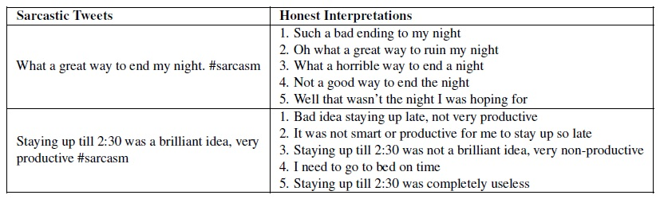

# Sarcasm SIGN

## Overview

This repository contains the Sarcasm SIGN dataset, a parallel corpus of sarcastic tweets and their non-sarcastic interpretations, as created by human experts. This corpus was created as part of our paper *Sarcasm SIGN: Interpreting Sarcasm with Sentiment Based
Monolingual Machine Translation* which will be presented in ACL 2017. The repository contains two folders: "corpus" which contains the Sarcasm SIGN dataset (described in the ACL paper) as well as the instructions for our human experts; and "preprocess" which contains code for preprocessing the data and preparing it for a MT system (see ReadMe in preprocess folder).

## Characteristics

The Sarcasm SIGN dataset is comprised of 3000 sarcastic tweets (tweets marked with *#sarcasm*), which are written in English, are not retweets, and do not contain URLs or images. The average sarcastic tweet length is 13.87 words, average interpretation length is 12.10 words and the vocabulary size is 8788 unique words. Each sarcastic tweet has five different non sarcastic interpretation. Following are two examples from our dataset:

sentences balancing multiple genres. It is special for having two kinds of double annotations: Each sentence was annotated according to both the emotion which is expressed by the writer, and the emotion which is perceived by the readers. Also, a subset of the corpus have been previously annotated according to Ekmans 6 Basic Emotions (Strapparava and Mihalcea, 2007) so that mappings between both representation formats become possible.

Attribution of Raw Data

The raw data of EmoBank is gathered from MASC, the manually annotated subcorpus of the ANC (Ide et al., 2010) and the SemEval 2007 Task 14 (Strapparava & Mihalcea, 2007). The raw data of the pilot studies is taken from MASC and the Standford Sentiment Treebank (Socher et al., 2013), originally collected by Pang and Lee (2005).

License

This work is licensed under CC-BY 4.0: https://creativecommons.org/licenses/by/4.0/

Citation

Please cite the following papers if you use EmoBank:

Sven Buechel and Udo Hahn. 2017. EmoBank: Studying the Impact of Annotation Perspective and Representation Format on Dimensional Emotion Analysis. In EACL 2017 - Proceedings of the 15th Conference of the European Chapter of the Association for Computational Linguistics. Valencia, Spain, April 3-7, 2017. Volume 2, Short Papers, pages 578-585. Available: http://aclweb.org/anthology/E17-2092

Sven Buechel and Udo Hahn. 2017. Readers vs. writers vs. texts: Coping with different perspectives of text understanding in emotion annotation. In LAW 2017 - Proceedings of the 11th Linguistic Annotation Workshop @ EACL 2017. Valencia, Spain, April 3, 2017, pages 1-12. Available: https://sigann.github.io/LAW-XI-2017/papers/LAW01.pdf

Contact

I am happy answer questions and give additional information via email: sven.buechel@uni-jena.de

References

Nancy C. Ide, Collin F. Baker, Christiane Fellbaum, and Rebecca J. Passonneau. 2010. The Manually Annotated Sub-Corpus: A community resource for and by the people. In ACL 2010 — Proceedings of the 48th Annual Meeting of the Association for Computational Linguistics. Uppsala, Sweden, 11-16 July 2010, volume 2: Short Papers, pages 68–73.
Bo Pang and Lillian Lee. 2005. Seeing stars: Exploiting class relationships for sentiment categorization with respect to rating scales. In ACL 2005 — Proceedings of the 43rd Annual Meeting of the Association for Computational Linguistics. AnnArbor, Michigan, USA, June 25–30, 2005, pages 115–124.
Richard Socher, Alex Perelygin, Jean Y. Wu, Jason Chuang, Christopher D. Manning, Andrew Y. Ng, and Christopher Potts. 2013. Recursive deep models for semantic compositionality over a sentiment treebank. In EMNLP 2013 — Proceedings of the 2013 Conference on Empirical Methods in Natural Language Processing. Seattle, Washington, USA, 18-21 October 2013, pages 1631–1642.
Carlo Strapparava and Rada Mihalcea. 2007. SemEval-2007 Task 14: Affective text. In SemEval 2007 — Proceedings of the 4th International Workshop on Semantic Evaluations @ ACL 2007. Prague, Czech Republic, June 23-24, 2007, pages 70–74.
